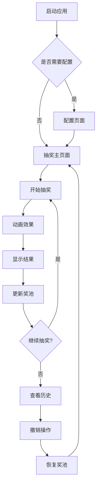

## 1. 产品概述
IST实验室晚会抽奖程序是一个专为实验室活动设计的互动抽奖应用。该程序提供灵活的奖券配置、多层级奖项设置、实时抽奖结果展示，以及撤销重抽功能，为实验室晚会增添科技感和趣味性。

目标用户：IST实验室成员、活动组织者。产品价值：简化抽奖流程，提升活动互动体验，确保抽奖公平透明。

## 2. 核心功能

### 2.1 功能模块
抽奖程序包含以下核心页面：
1. **抽奖主页面**：奖券池展示、抽奖控制、中奖结果展示
2. **配置页面**：奖券范围设置、奖项等级配置、抽奖参数调整
3. **历史记录页面**：中奖记录查看、撤销操作、统计信息

### 2.2 页面详情
| 页面名称 | 模块名称 | 功能描述 |
|-----------|-------------|-------------|
| 抽奖主页面 | 奖券池展示 | 以网格形式显示所有可用奖券编号，已抽中奖券高亮显示并移出奖池 |
| 抽奖主页面 | 抽奖控制面板 | 显示当前奖项等级、剩余奖券数量、开始/停止抽奖按钮 |
| 抽奖主页面 | 中奖结果展示 | 大字体显示中奖号码，配合炫酷动画效果 |
| 抽奖主页面 | 快速操作栏 | 提供撤销上次抽奖、重置奖池、切换奖项等快捷操作 |
| 配置页面 | 奖券范围设置 | 设置起始编号和结束编号（如1-50），支持自定义范围 |
| 配置页面 | 奖项等级配置 | 添加/编辑奖项等级（如一等奖、二等奖、三等奖），设置每个等级的中奖数量，**并可为每个奖项配置专属中奖音乐** |
| 配置页面 | 抽奖参数设置 | 设置抽奖动画速度、全局音效开关、界面主题等 |
| 历史记录页面 | 中奖记录列表 | 按时间顺序显示所有中奖记录，包含奖项等级、中奖号码、中奖时间 |
| 历史记录页面 | 撤销操作 | 选择特定中奖记录进行撤销，将号码返还奖池 |
| 历史记录页面 | 统计信息 | 显示各奖项剩余数量、总中奖率、抽奖进度等 |

## 3. 核心流程

### 3.1 抽奖流程
1. 用户进入应用，系统加载默认配置或上次保存的配置
2. 用户可以在配置页面设置奖券范围和奖项等级
3. 返回主页面，点击"开始抽奖"按钮启动抽奖动画
4. 系统从可用奖池中随机选择号码，播放炫酷动画效果
5. 动画结束后显示中奖号码，自动将该号码移出奖池
6. 中奖记录自动保存到历史记录中

### 3.2 撤销流程
1. 用户点击"撤销"按钮或进入历史记录页面
2. 选择要撤销的中奖记录
3. 确认撤销操作，中奖号码重新加入奖池
4. 对应奖项的剩余数量增加，统计信息更新

## 4. 用户界面设计

### 4.1 设计风格
- **主色调**：深蓝色渐变（#1a1a2e → #16213e）搭配霓虹蓝（#00d4ff）
- **辅助色**：科技紫（#9d4edd）、活力橙（#ff6b35）
- **按钮样式**：圆角矩形，悬停发光效果，点击脉冲动画
- **字体选择**：主标题使用Orbitron（科技感），正文使用Roboto
- **布局风格**：卡片式布局，深色主题，星空背景动画
- **图标风格**：线性图标，配合发光效果

### 4.2 页面设计概述
| 页面名称 | 模块名称 | UI元素 |
|-----------|-------------|-------------|
| 抽奖主页面 | 奖券池展示 | 网格布局显示奖券，每个号码为圆形卡片，未抽取为半透明蓝色，已抽取为红色禁用状态，悬停时有缩放动画 |
| 抽奖主页面 | 抽奖控制面板 | 居中大按钮，开始为绿色发光，抽奖中为旋转动画，停止为红色，显示当前奖项和剩余数量 |
| 抽奖主页面 | 中奖结果展示 | 全屏遮罩，中奖号码以超大字体显示，配合粒子爆炸动画和脉冲光效 |
| 配置页面 | 奖券范围设置 | 滑块或数字输入框，实时显示范围预览，确认按钮有波纹扩散效果 |
| 配置页面 | 奖项等级配置 | 动态添加的卡片列表，每个奖项可编辑名称、数量和奖品描述，支持拖拽排序 |
| 历史记录页面 | 中奖记录列表 | 时间线式布局，可折叠的详细信息，撤销按钮有警告色提示 |

### 4.3 响应式设计
- **桌面优先**：针对1920×1080分辨率优化，支持大屏幕展示
- **移动端适配**：支持平板和手机访问，触摸友好的大按钮设计
- **交互优化**：支持键盘快捷键（空格键开始/停止抽奖，ESC键撤销）

### 4.4 动画效果指导
- **抽奖动画**：数字快速滚动效果 → 逐渐减速 → 最终定格
- **中奖动画**：粒子爆炸、光环扩散、数字放大抖动
- **背景动画**：星空粒子缓慢移动，营造深邃空间感
- **过渡动画**：页面切换使用淡入淡出，按钮点击有缩放反馈
- **音效配合**：抽奖时播放科技感音效，中奖时播放**该奖项配置的专属音乐**（如未配置则播放默认胜利音效）