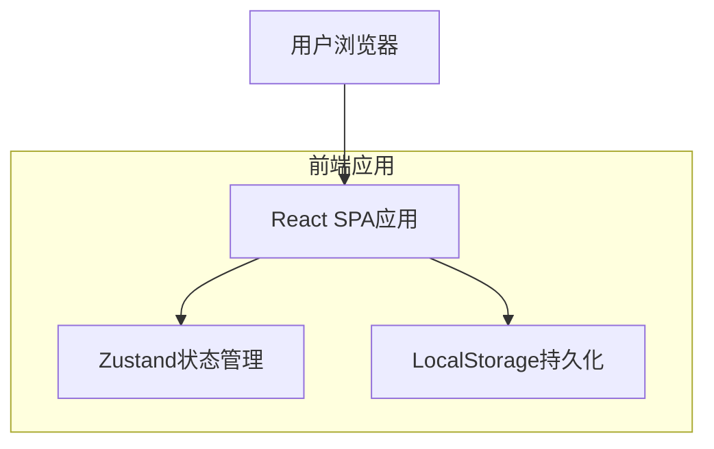

## 1. 架构设计



## 2. 技术描述

- **前端框架**: React@18 + TypeScript + Vite
- **初始化工具**: vite-init
- **状态管理**: Zustand
- **UI组件库**: TailwindCSS + HeadlessUI
- **动画库**: Framer Motion
- **图标库**: Lucide React
- **后端服务**: 无（纯前端应用，数据本地存储）

## 3. 路由定义

| 路由 | 用途 |
|-------|---------|
| / | 抽奖主页面，显示奖券池和抽奖控制 |
| /config | 配置页面，设置奖券范围和奖项等级 |
| /history | 历史记录页面，查看中奖记录和撤销操作 |

## 4. 状态管理设计

### 4.1 核心状态类型定义

```typescript
// 奖项等级类型
interface PrizeLevel {
  id: string;
  name: string;      // 奖项名称（如"一等奖"）
  count: number;     // 该奖项数量
  remaining: number; // 剩余数量
  color: string;     // 主题颜色
  musicUrl?: string; // 中奖音乐URL（可选）
}

// 奖券状态类型
interface Ticket {
  number: number;    // 奖券编号
  isDrawn: boolean;  // 是否已抽取
  drawnAt?: Date;    // 抽取时间
  prizeLevel?: string; // 中奖等级ID
}

// 中奖记录类型
interface DrawRecord {
  id: string;
  ticketNumber: number;
  prizeLevel: PrizeLevel;
  drawnAt: Date;
  isRevoked: boolean;
}

// 应用状态类型
interface AppState {
  tickets: Ticket[];           // 所有奖券
  prizeLevels: PrizeLevel[];    // 奖项等级配置
  drawRecords: DrawRecord[];  // 抽奖历史
  currentPrizeLevel: string;   // 当前抽奖等级
  isDrawing: boolean;         // 是否正在抽奖
  config: {
    startNumber: number;       // 起始编号
    endNumber: number;         // 结束编号
    animationSpeed: number;    // 动画速度
    soundEnabled: boolean;     // 音效开关
  };
}
```

### 4.2 状态操作定义

```typescript
interface AppActions {
  // 配置相关
  setTicketRange: (start: number, end: number) => void;
  addPrizeLevel: (level: Omit<PrizeLevel, 'id' | 'remaining'>) => void;
  updatePrizeLevel: (id: string, updates: Partial<PrizeLevel>) => void;
  removePrizeLevel: (id: string) => void;
  
  // 抽奖相关
  startDrawing: () => void;
  stopDrawing: () => number | null; // 返回中奖号码
  completeDraw: (ticketNumber: number, prizeLevelId: string) => void;
  
  // 撤销相关
  revokeDraw: (recordId: string) => void;
  
  // 重置相关
  resetAll: () => void;
  resetPool: () => void;
  
  // 设置相关
  updateConfig: (updates: Partial<AppState['config']>) => void;
}
```

## 5. 组件架构

### 5.1 主要组件结构

```
src/
├── components/
│   ├── lottery/
│   │   ├── TicketPool.tsx          # 奖券池展示
│   │   ├── DrawControl.tsx         # 抽奖控制面板
│   │   ├── DrawResult.tsx          # 中奖结果展示
│   │   └── DrawingAnimation.tsx    # 抽奖动画
│   ├── config/
│   │   ├── TicketRangeConfig.tsx   # 奖券范围配置
│   │   ├── PrizeLevelConfig.tsx    # 奖项等级配置
│   │   └── SettingsPanel.tsx       # 通用设置
│   ├── history/
│   │   ├── DrawHistory.tsx         # 抽奖历史列表
│   │   ├── RevokeButton.tsx        # 撤销按钮
│   │   └── Statistics.tsx           # 统计信息
│   └── common/
│       ├── Layout.tsx              # 页面布局
│       ├── Navigation.tsx          # 导航组件
│       └── ThemeToggle.tsx         # 主题切换
├── hooks/
│   ├── useLottery.ts               # 抽奖逻辑钩子
│   ├── useSound.ts                 # 音效钩子
│   └── useStorage.ts               # 本地存储钩子
├── stores/
│   └── useLotteryStore.ts          # Zustand状态管理
├── utils/
│   ├── lottery.ts                  # 抽奖算法
│   ├── animation.ts                # 动画工具
│   └── storage.ts                  # 存储工具
└── types/
    └── index.ts                    # 类型定义
```

### 5.2 核心算法实现

```typescript
// 抽奖算法
export function drawTicket(tickets: Ticket[]): number | null {
  const availableTickets = tickets.filter(t => !t.isDrawn);
  if (availableTickets.length === 0) return null;
  
  const randomIndex = Math.floor(Math.random() * availableTickets.length);
  return availableTickets[randomIndex].number;
}

// 动画缓动函数
export const easeOutCubic = (t: number): number => {
  return 1 - Math.pow(1 - t, 3);
};

// 随机颜色生成
export const generateRandomColor = (): string => {
  const colors = ['#00d4ff', '#9d4edd', '#ff6b35', '#4ecdc4', '#45b7d1'];
  return colors[Math.floor(Math.random() * colors.length)];
};
```

## 6. 本地存储设计

### 6.1 存储结构

```typescript
interface StorageData {
  version: string;              // 数据版本号
  lastUpdated: number;          // 最后更新时间
  state: AppState;              // 应用状态
}
```

### 6.2 存储键名

- `ist-lottery-config`: 应用配置信息
- `ist-lottery-state`: 当前抽奖状态
- `ist-lottery-history`: 历史记录数据

### 6.3 自动保存策略

- 每次状态变更后500ms内自动保存
- 页面卸载前强制保存
- 最多保存1000条历史记录，超出时自动清理最早记录

## 7. 性能优化

### 7.1 渲染优化

- 使用React.memo优化组件重渲染
- 虚拟化长列表（历史记录超过100条时）
- 动画使用GPU加速（transform3d）

### 7.2 内存优化

- 及时清理过期的历史记录
- 使用WeakMap存储临时数据
- 避免在状态存储大对象

### 7.3 用户体验优化

- 添加加载状态指示器
- 实现错误边界处理
- 支持键盘快捷键操作
- 提供操作确认对话框